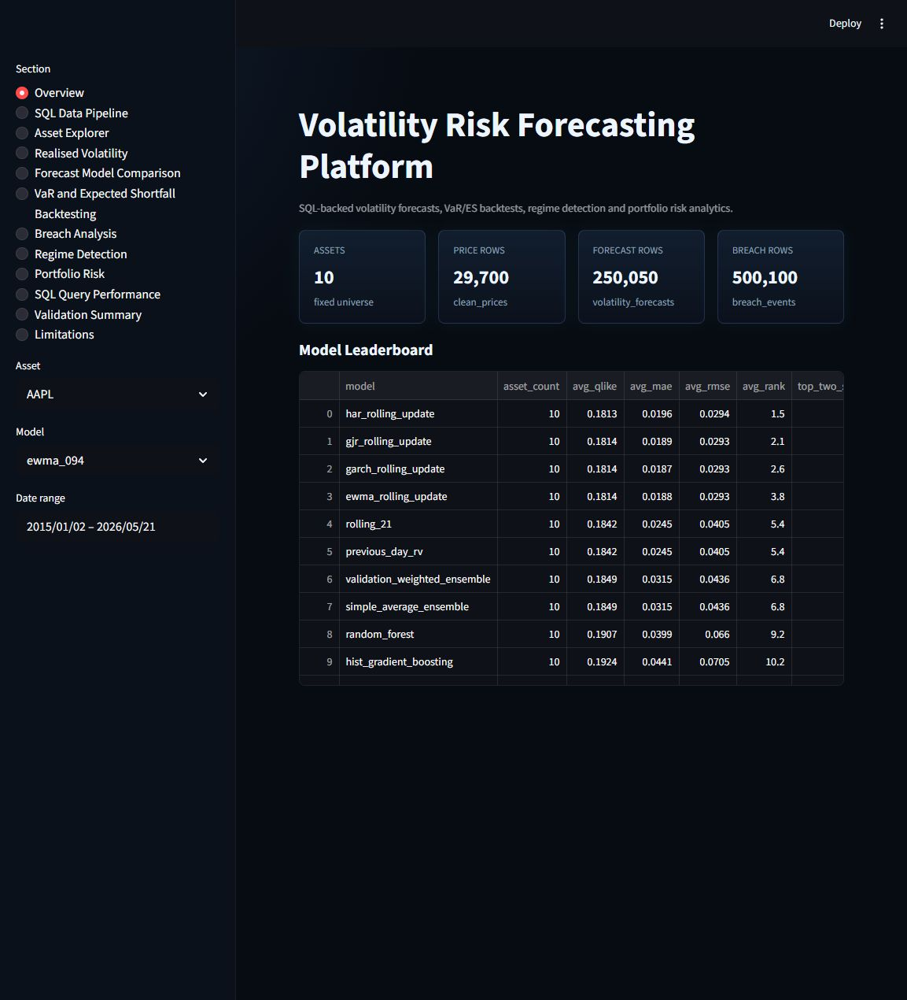
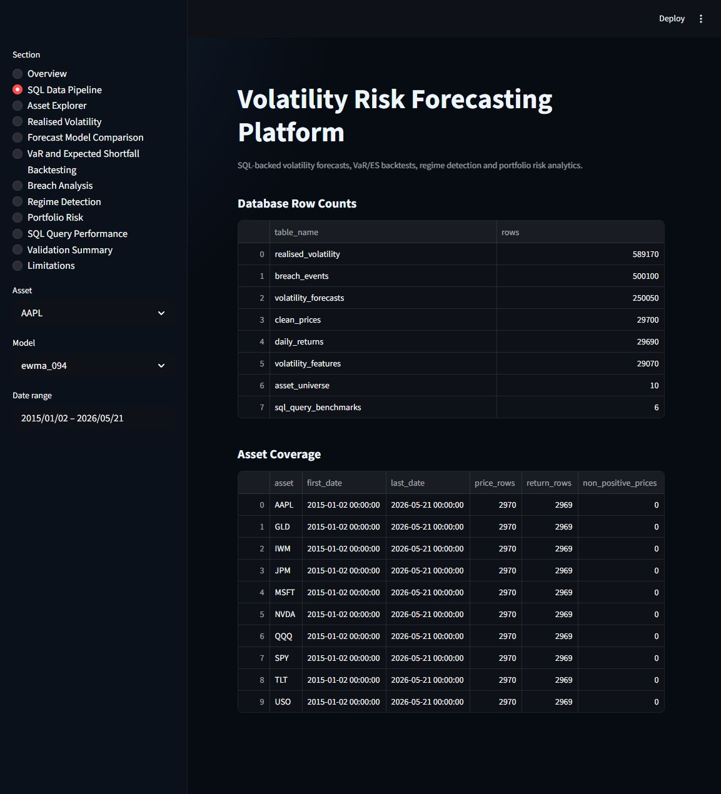
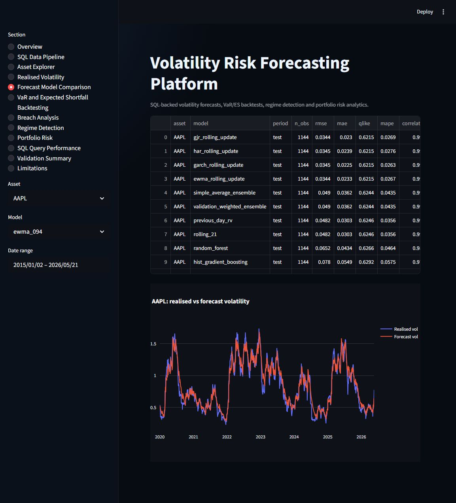
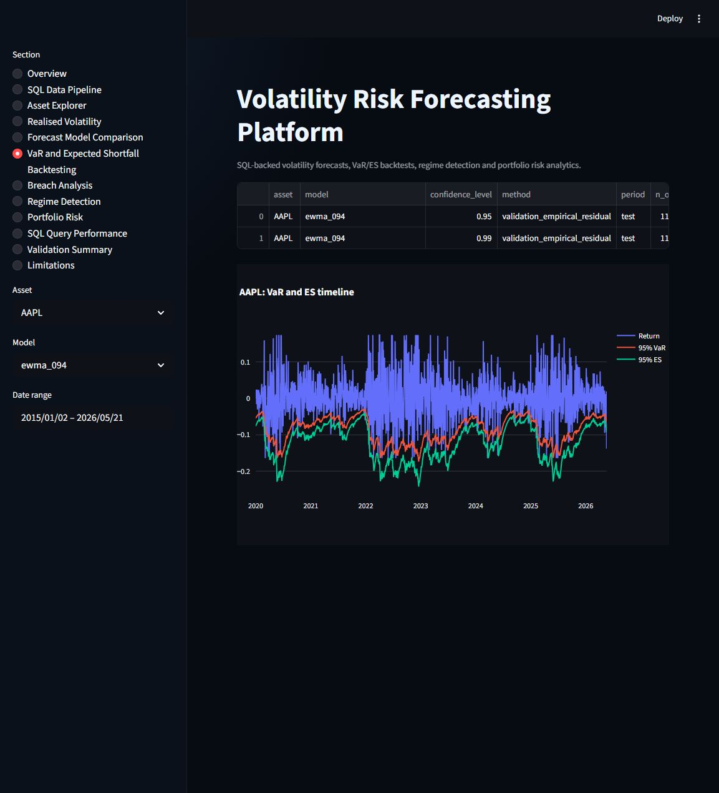
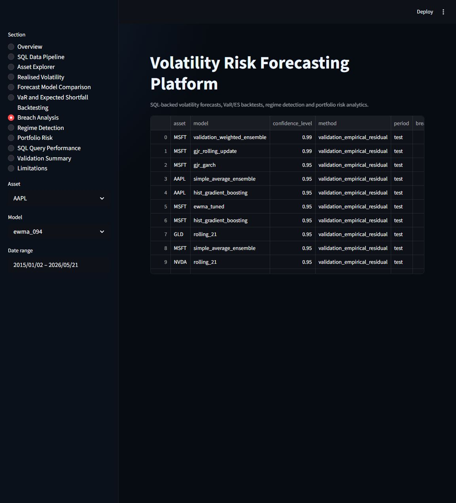
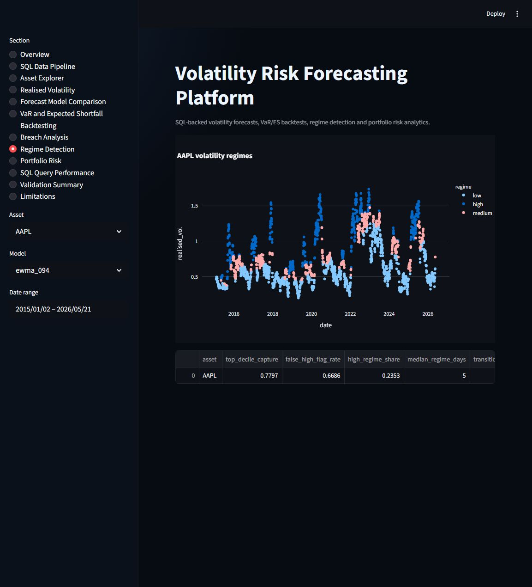
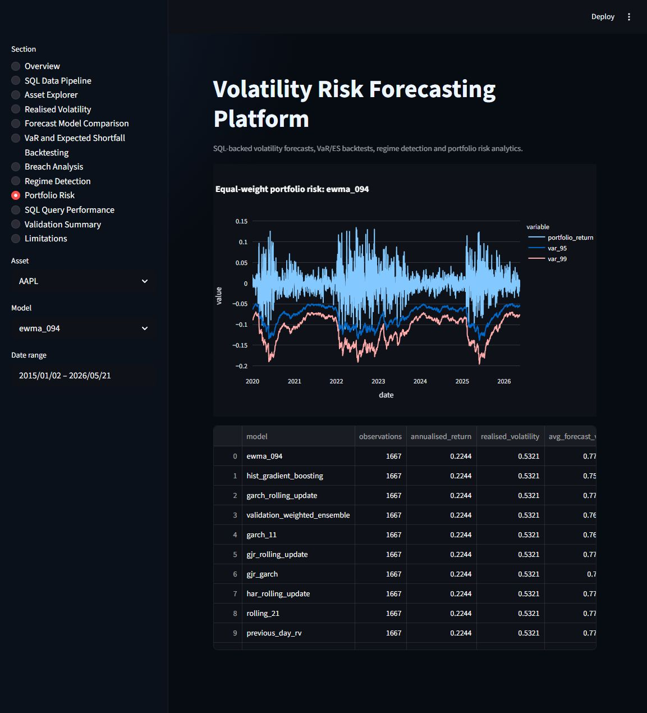
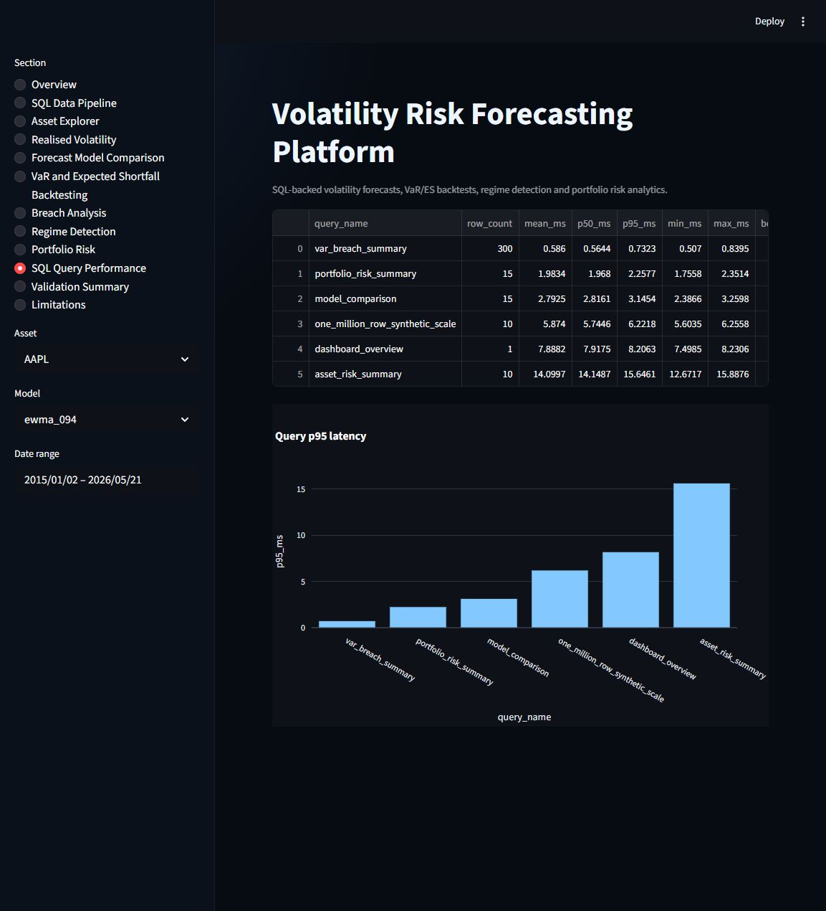

# Volatility Risk Forecasting Platform


A SQL-backed market risk and volatility forecasting platform built with Python, DuckDB, pandas, scikit-learn, `arch`, Streamlit and Plotly.
The project combines reproducible market-data ingestion, database-first analytics, volatility models, VaR and Expected Shortfall backtesting, regime detection, portfolio risk and dashboard reporting.

## What This Project Demonstrates

- SQL-centred analytical engineering using DuckDB tables, validation views and dashboard views.
- Time-series model validation with fixed train, validation and test periods.
- Volatility forecasting across rolling, EWMA, GARCH-family, machine-learning and ensemble models.
- Market risk conversion from volatility forecasts into VaR and Expected Shortfall.
- Statistical backtesting with Kupiec and Christoffersen tests.
- Reporting discipline: weak metrics are shown rather than hidden.

## Why It Matters For Quant And Risk Roles

Risk analytics work rarely stops at fitting a model. A useful platform needs data controls, SQL lineage, reproducible model outputs, independent validation and dashboard-ready summaries.
This repository is designed to show that full workflow: from prices to forecasts, from forecasts to risk estimates, and from risk estimates to validation reports.

## Headline Results

- Latest generated report data source: `yfinance`.
- Data date range: 2015-01-02 00:00:00 to 2026-05-20 00:00:00.
- Best aggregate test-period model by QLIKE: `har_rolling_update`.
- Average QLIKE improvement versus rolling 21-day volatility: 40.41%.
- Average QLIKE improvement versus EWMA: 83.15%.
- Average QLIKE improvement versus GARCH(1,1): 91.50%.
- Top-two asset share for the best aggregate model: 80.00%.
- Average 95% VaR breach rate across test results: 4.76%.
- Average 99% VaR breach rate across test results: 0.81%.
- Average top-decile volatility capture: 75.44%.
- Average high-volatility precision: 43.46%.
- Average high-volatility F1 score: 55.07%.
- Average false high-volatility flag rate: 56.54%.
- Largest SQL scale benchmark: 2,873,756 rows.
- Dashboard query p95 latency: 16.14 ms.

## Target Achievement

| Target | Result | Status |
| --- | --- | --- |
| QLIKE improvement vs rolling vol >= 12% | 40.41% | pass |
| QLIKE improvement vs EWMA >= 5% | 83.15% | pass |
| QLIKE improvement vs GARCH >= 5% | 91.50% | pass |
| Best/top-2 model across >= 70% assets | 80.00% | pass |
| 95% VaR breach rate 4.7%-5.3% | 4.76% | pass |
| 99% VaR breach rate 0.8%-1.2% | 0.81% | pass |
| Kupiec not rejected for most assets | 85.79% | pass |
| Christoffersen not rejected for most assets | 87.89% | pass |
| ES tail-loss ratio 0.9-1.1 | 0.984 | pass |
| Top-decile vol capture >= 75% | 75.44% | pass |
| High-vol precision >= 40% | 43.46% | pass |
| High-vol F1 >= 50% | 55.07% | pass |
| False high-vol flag rate <= 60% | 56.54% | pass |
| SQL handles 1m+ rows | 2,873,756 | pass |
| Dashboard queries < 1 sec | 16.14 ms p95 | pass |
| Tests pass | passed | pass |

## SQL Architecture Summary

DuckDB is the default database. The platform stores raw prices, cleaned prices, returns, realised volatility, features, forecasts, VaR and ES estimates, breaches, regime labels, model metrics and query benchmarks.
Dashboard sections are backed by SQL views such as `v_dashboard_overview`, `v_model_comparison`, `v_var_breach_summary`, `v_asset_risk_summary` and `v_portfolio_risk_summary`.

## Model Comparison Summary

| model | avg_qlike | avg_rank | top_two_share | improvement_vs_rolling_21 | improvement_vs_ewma | improvement_vs_garch |
| --- | --- | --- | --- | --- | --- | --- |
| har_rolling_update | 0.0056 | 1.8000 | 0.8000 | 0.4041 | 0.8315 | 0.9150 |
| garch_rolling_update | 0.0056 | 2.4000 | 0.5000 | 0.4010 | 0.8307 | 0.9145 |
| gjr_rolling_update | 0.0056 | 2.5000 | 0.6000 | 0.3979 | 0.8298 | 0.9138 |
| ewma_rolling_update | 0.0057 | 3.3000 | 0.1000 | 0.3938 | 0.8286 | 0.9135 |
| validation_weighted_ensemble | 0.0079 | 5.6000 | 0.0000 | 0.1653 | 0.7638 | 0.8815 |
| har_rv_market_huber | 0.0091 | 7.3000 | 0.0000 | 0.0128 | 0.7204 | 0.8586 |
| previous_day_rv | 0.0093 | 7.9000 | 0.0000 | 0.0000 | 0.7172 | 0.8567 |
| rolling_21 | 0.0093 | 7.9000 | 0.0000 | 0.0000 | 0.7172 | 0.8567 |
| har_rv_log_ridge | 0.0094 | 7.9000 | 0.0000 | -0.0126 | 0.7133 | 0.8562 |
| simple_average_ensemble | 0.0096 | 9.3000 | 0.0000 | -0.0282 | 0.7092 | 0.8547 |
| har_rv_market_log_ridge | 0.0097 | 9.1000 | 0.0000 | -0.0368 | 0.7065 | 0.8530 |
| random_forest | 0.0235 | 12.8000 | 0.0000 | -1.7592 | 0.2139 | 0.6105 |
| hist_gradient_boosting | 0.0269 | 13.6000 | 0.0000 | -2.1083 | 0.1137 | 0.5707 |
| ewma_tuned | 0.0293 | 13.8000 | 0.0000 | -2.1536 | 0.1073 | 0.5501 |
| ewma_094 | 0.0331 | 14.4000 | 0.0000 | -2.5678 | 0.0000 | 0.4881 |
| garch_11 | 0.0741 | 16.5000 | 0.0000 | -6.6866 | -1.1789 | 0.0000 |
| egarch_t | 0.0761 | 16.9000 | 0.0000 | -7.2391 | -1.3267 | -0.1267 |
| rolling_63 | 0.0999 | 17.8000 | 0.0000 | -9.9984 | -2.0768 | -0.6198 |
| gjr_garch | 0.1580 | 18.2000 | 0.0000 | -16.1721 | -3.6691 | -1.5115 |

## VaR And ES Backtesting Summary

| model | confidence_level | avg_breach_rate | kupiec_not_rejected | christoffersen_not_rejected | avg_es_tail_loss_ratio | avg_max_cluster |
| --- | --- | --- | --- | --- | --- | --- |
| egarch_t | 0.9500 | 0.0462 | 0.9000 | 0.9000 | 0.9569 | 2.3000 |
| egarch_t | 0.9900 | 0.0081 | 0.9000 | 0.7000 | 0.9748 | 1.7000 |
| ewma_094 | 0.9500 | 0.0488 | 0.9000 | 0.8000 | 0.9659 | 2.2000 |
| ewma_094 | 0.9900 | 0.0077 | 0.8000 | 0.6000 | 1.0402 | 1.6000 |
| ewma_rolling_update | 0.9500 | 0.0489 | 1.0000 | 0.9000 | 0.9638 | 2.0000 |
| ewma_rolling_update | 0.9900 | 0.0088 | 0.8000 | 1.0000 | 1.0060 | 1.4000 |
| ewma_tuned | 0.9500 | 0.0491 | 1.0000 | 0.8000 | 0.9674 | 2.1000 |
| ewma_tuned | 0.9900 | 0.0086 | 0.8000 | 0.6000 | 1.0266 | 1.6000 |
| garch_11 | 0.9500 | 0.0490 | 1.0000 | 0.9000 | 0.9702 | 2.2000 |
| garch_11 | 0.9900 | 0.0091 | 1.0000 | 0.7000 | 0.9855 | 1.7000 |
| garch_rolling_update | 0.9500 | 0.0490 | 1.0000 | 1.0000 | 0.9649 | 2.0000 |
| garch_rolling_update | 0.9900 | 0.0088 | 0.8000 | 1.0000 | 0.9976 | 1.4000 |
| gjr_garch | 0.9500 | 0.0458 | 0.9000 | 0.8000 | 0.9774 | 2.2000 |
| gjr_garch | 0.9900 | 0.0086 | 0.8000 | 0.7000 | 0.9990 | 1.6000 |
| gjr_rolling_update | 0.9500 | 0.0494 | 1.0000 | 1.0000 | 0.9612 | 2.0000 |
| gjr_rolling_update | 0.9900 | 0.0088 | 0.8000 | 1.0000 | 0.9982 | 1.4000 |
| har_rolling_update | 0.9500 | 0.0492 | 1.0000 | 0.9000 | 0.9624 | 2.0000 |
| har_rolling_update | 0.9900 | 0.0087 | 0.8000 | 1.0000 | 1.0071 | 1.4000 |
| har_rv_log_ridge | 0.9500 | 0.0497 | 1.0000 | 0.9000 | 0.9607 | 2.1000 |
| har_rv_log_ridge | 0.9900 | 0.0083 | 0.8000 | 0.9000 | 1.0044 | 1.5000 |
| har_rv_market_huber | 0.9500 | 0.0497 | 1.0000 | 0.9000 | 0.9607 | 2.0000 |
| har_rv_market_huber | 0.9900 | 0.0084 | 0.8000 | 0.9000 | 1.0111 | 1.5000 |
| har_rv_market_log_ridge | 0.9500 | 0.0503 | 1.0000 | 0.9000 | 0.9603 | 2.1000 |
| har_rv_market_log_ridge | 0.9900 | 0.0084 | 0.8000 | 1.0000 | 1.0119 | 1.5000 |
| hist_gradient_boosting | 0.9500 | 0.0411 | 0.7000 | 0.8000 | 0.9417 | 2.0000 |
| hist_gradient_boosting | 0.9900 | 0.0064 | 0.7000 | 1.0000 | 0.9856 | 1.2000 |
| previous_day_rv | 0.9500 | 0.0487 | 0.9000 | 0.9000 | 0.9637 | 2.0000 |
| previous_day_rv | 0.9900 | 0.0084 | 0.8000 | 1.0000 | 1.0104 | 1.4000 |
| random_forest | 0.9500 | 0.0409 | 0.7000 | 0.9000 | 0.9423 | 2.1000 |
| random_forest | 0.9900 | 0.0065 | 0.7000 | 1.0000 | 0.9873 | 1.3000 |
| rolling_21 | 0.9500 | 0.0487 | 0.9000 | 0.9000 | 0.9637 | 2.0000 |
| rolling_21 | 0.9900 | 0.0084 | 0.8000 | 1.0000 | 1.0104 | 1.4000 |
| rolling_63 | 0.9500 | 0.0411 | 0.6000 | 0.9000 | 0.9499 | 2.3000 |
| rolling_63 | 0.9900 | 0.0062 | 0.6000 | 0.6000 | 1.0351 | 1.6000 |
| simple_average_ensemble | 0.9500 | 0.0491 | 1.0000 | 1.0000 | 0.9610 | 2.1000 |
| simple_average_ensemble | 0.9900 | 0.0081 | 0.8000 | 0.8000 | 1.0154 | 1.5000 |
| validation_weighted_ensemble | 0.9500 | 0.0498 | 1.0000 | 0.9000 | 0.9636 | 2.1000 |
| validation_weighted_ensemble | 0.9900 | 0.0083 | 0.8000 | 0.9000 | 1.0144 | 1.5000 |

## Regime Detection Summary

| asset | top_decile_capture | false_high_flag_rate | precision | recall | f1_score | false_positive_rate | high_regime_share | median_regime_days | transition_count |
| --- | --- | --- | --- | --- | --- | --- | --- | --- | --- |
| AAPL | 0.8211 | 0.5543 | 0.4457 | 0.8211 | 0.5778 | 0.1138 | 0.1848 | 8.0000 | 195 |
| GLD | 0.8070 | 0.5944 | 0.4056 | 0.8070 | 0.5399 | 0.1318 | 0.1996 | 5.0000 | 258 |
| IWM | 0.6246 | 0.6447 | 0.3553 | 0.6246 | 0.4529 | 0.1264 | 0.1763 | 5.0000 | 235 |
| JPM | 0.7088 | 0.5968 | 0.4032 | 0.7088 | 0.5140 | 0.1170 | 0.1763 | 5.0000 | 196 |
| MSFT | 0.7123 | 0.5662 | 0.4338 | 0.7123 | 0.5392 | 0.1037 | 0.1647 | 6.0000 | 176 |
| NVDA | 0.9684 | 0.4491 | 0.5509 | 0.9684 | 0.7023 | 0.0880 | 0.1763 | 7.0000 | 176 |
| QQQ | 0.7860 | 0.5676 | 0.4324 | 0.7860 | 0.5579 | 0.1150 | 0.1823 | 7.5000 | 171 |
| SPY | 0.7123 | 0.5874 | 0.4126 | 0.7123 | 0.5225 | 0.1131 | 0.1732 | 9.0000 | 152 |
| TLT | 0.6667 | 0.6008 | 0.3992 | 0.6667 | 0.4993 | 0.1119 | 0.1675 | 4.0000 | 260 |
| USO | 0.7368 | 0.4928 | 0.5072 | 0.7368 | 0.6009 | 0.0798 | 0.1457 | 4.0000 | 216 |

## SQL Performance Summary

| query_name | row_count | mean_ms | p50_ms | p95_ms | min_ms | max_ms | benchmark_rows | created_at |
| --- | --- | --- | --- | --- | --- | --- | --- | --- |
| dashboard_overview | 1 | 8.1529 | 8.0724 | 8.9104 | 7.6357 | 9.2214 | 2873756 | 2026-05-22 16:42:07.325510 |
| model_comparison | 19 | 3.2389 | 3.1368 | 3.8320 | 2.7686 | 3.9398 | 2873756 | 2026-05-22 16:42:07.325510 |
| var_breach_summary | 380 | 0.7171 | 0.6868 | 0.8868 | 0.5888 | 0.9702 | 2873756 | 2026-05-22 16:42:07.325510 |
| asset_risk_summary | 10 | 14.3434 | 13.8564 | 16.1382 | 13.2163 | 16.5441 | 2873756 | 2026-05-22 16:42:07.325510 |
| portfolio_risk_summary | 19 | 2.4738 | 2.3446 | 3.1312 | 2.0691 | 3.5060 | 2873756 | 2026-05-22 16:42:07.325510 |
| one_million_row_synthetic_scale | 10 | 6.2641 | 6.2310 | 6.5336 | 6.0207 | 6.5708 | 1144800 | 2026-05-22 16:42:07.325510 |

## Dashboard Screenshots

The screenshots below were captured from the local Streamlit dashboard after the full pipeline run.











## Project Architecture

```text
volatility-risk-forecasting-platform/
|-- app/                    Streamlit dashboard and reusable UI helpers
|-- data/                   Offline sample data and data notes
|-- database/               DuckDB database location
|-- docs/                   Methodology, SQL architecture and validation notes
|-- examples/               One-command pipeline entry points
|-- notebooks/              Executable notebooks using package modules
|-- reports/                Generated validation, model, risk and SQL reports
|-- sql/                    Schema, validation views and dashboard views
|-- src/volatility_platform Core package
|-- tests/                  Unit, integration and smoke tests
```

## Module Map

- `data`: universe definition, optional live download, offline sample loading and cleaning.
- `database`: DuckDB connection, schema execution, build pipeline and validation queries.
- `features`: returns, realised-volatility estimators, lagged volatility features and regime features.
- `models`: baselines, EWMA, GARCH-family wrappers, tree models, ensembles and walk-forward orchestration.
- `risk`: VaR, Expected Shortfall, portfolio risk, stress scenarios and risk contributions.
- `backtesting`: forecast metrics, Kupiec, Christoffersen, ES diagnostics and breach clustering.
- `regimes`: high/medium/low volatility labelling and change-point helpers.
- `reporting`: Markdown and CSV report generation.

## Data Pipeline

The default pipeline uses `data/sample_prices.csv` so the repository runs offline without API keys.
Live data can be requested with `--live`, in which case downloaded files are cached under `data/raw/` and excluded from version control.
Generated reports explicitly state whether they were produced from live yfinance data or the sample fallback.
The fixed universe is SPY, QQQ, IWM, TLT, GLD, USO, AAPL, MSFT, NVDA and JPM.

## Methodology

The core target is next-day 21-day close-to-close realised volatility. Features are observed at forecast date `t`; the target is realised volatility on date `t+1`.
Training runs through 2019, validation through 2021 and final test from 2022 onward.
Ensemble weights and VaR residual calibration use validation data only.

## Installation

```bash
python -m venv .venv
source .venv/bin/activate  # Windows: .venv\Scripts\activate
python -m pip install --upgrade pip
python -m pip install -e .[dev]
```

## Build Database

```bash
python examples/build_database.py
python examples/build_database.py --live
```

## Run Forecasting

```bash
python examples/run_forecasting_pipeline.py
```

## Run Risk Backtest

```bash
python examples/run_var_backtest.py
```

## Generate Reports

```bash
python examples/run_regime_detection.py
python examples/benchmark_sql_queries.py
python examples/generate_all_reports.py
```

## Run Dashboard

```bash
streamlit run app/streamlit_app.py
```

## Testing

```bash
python -m compileall src app examples
python -m pytest -v
python -m ruff check .
python -m black --check .
```

## Limitations

- The offline dataset is designed for reproducibility; live public data should be used before quoting production conclusions.
- Daily data does not capture intraday volatility, microstructure noise or overnight liquidity gaps.
- GARCH estimates can fail or become unstable in short or highly stressed samples.
- Machine-learning models can under-react to regimes not represented in training data.
- VaR and ES backtests have limited statistical power, especially at the 99% level.
- SQL benchmark timings depend on local hardware, cache state and DuckDB version.

## Future Improvements

- Add intraday realised volatility when a free data source is available.
- Add PostgreSQL mode for multi-user deployment while keeping DuckDB as the default.
- Add Bayesian or state-space volatility models.
- Add model-risk challenger reports and stability monitoring.
- Add portfolio optimisation constraints and user-defined dashboard weights.

## CV Bullet Examples

- Built a SQL-backed volatility forecasting and market risk platform using Python, DuckDB and Streamlit, comparing rolling, EWMA, GARCH-family, HAR-RV and machine-learning models across a fixed multi-asset universe; best aggregate model improved out-of-sample QLIKE by 40.41% vs rolling volatility and 83.15% vs EWMA.
- Designed DuckDB SQL tables and validation views for prices, returns, realised volatility, forecasts, VaR/ES backtests and breach analytics, supporting reproducible risk reports and dashboard queries across 2,873,762+ persisted rows plus a 2,873,756-row scale benchmark.
- Implemented validation-period Student-t residual calibration for volatility-scaled VaR/ES, with Kupiec and Christoffersen backtests reported at asset/model level rather than selected examples.

## Interview Talking Points

- Why QLIKE is the primary volatility metric and why RMSE alone is not enough.
- How forecast-date and target-date keys prevent future-data leakage.
- Why validation-period calibration is acceptable but test-period calibration is not.
- How DuckDB views make the dashboard reproducible and auditable.
- What happens when GARCH, EWMA and tree models disagree during stress regimes.

## Reproducibility Notes

The repository includes generated reports and benchmark CSVs from the latest local run.
Regenerate all metrics after changing data, model code or dependencies.
